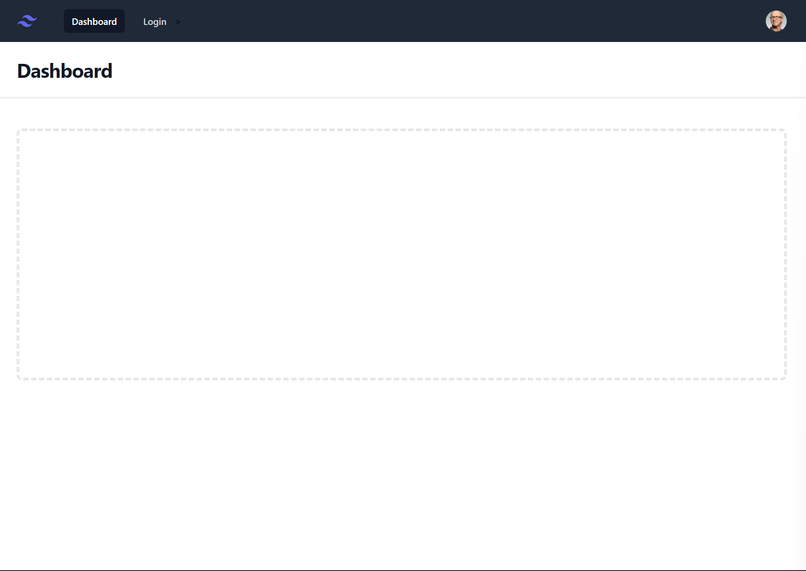

# ANGULAR TAILWIND

## links

- [Install Tailwind CSS with Angular](https://tailwindcss.com/docs/guides/angular)
- [Tailwind Components](https://tailwindui.com/components)

## commands

- ng new Angular
- npm install -D tailwindcss postcss autoprefixer
- npx tailwindcss init

```ts
module.exports = {
  content: ["./src/**/*.{html,ts}"],
  theme: {
    extend: {},
  },
  plugins: [],
};
```

- style.css

```css
@tailwind base;
@tailwind components;
@tailwind utilities;
```

## Login


## Dashboard


